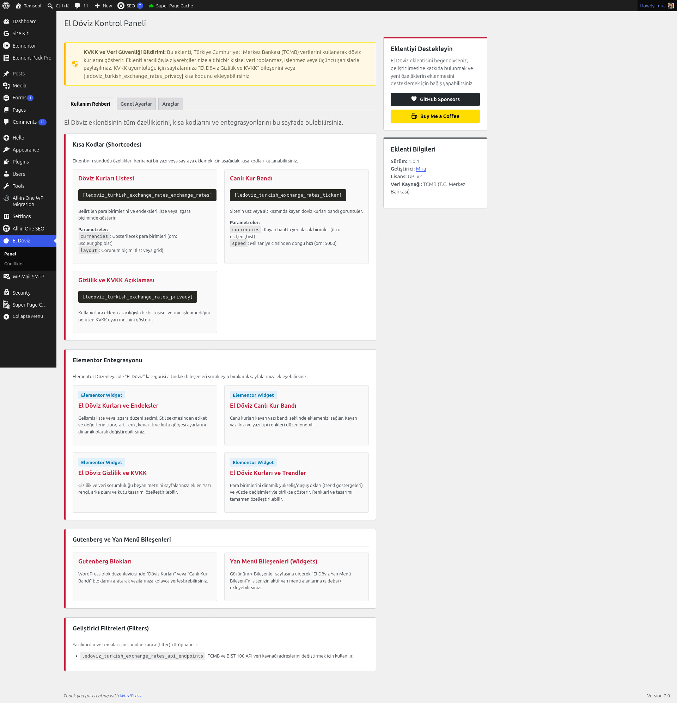

# 📈 LeDoviz - Turkish Exchange Rates


[](https://php.net)
[](https://www.gnu.org/licenses/gpl-2.0.html)
[](https://elementor.com)
[](https://wordpress.org/gutenberg/)

[Read in English](#english) | [Türkçe Oku](#türkçe)

📦 **Download from WordPress.org:** [https://wordpress.org/plugins/ledoviz-turkish-exchange-rates/](https://wordpress.org/plugins/ledoviz-turkish-exchange-rates/)

---

<a name="english"></a>
## English

**LeDoviz - Turkish Exchange Rates** is a premium, lightweight, and high-performance WordPress plugin designed to seamlessly display Turkish Central Bank (TCMB) exchange rates. It features native support for Elementor widgets, Gutenberg blocks, responsive sidebars, shortcodes, and scrolling marquees.

### ✨ Features
- **🚀 Multiple Display Options**: Grid, List, Scrolling Ticker, Sidebar, Header, and Footer display variations.
- **🎨 Premium Custom Styling**: Features a sleek Turkish-inspired styling palette (Persian Red accents with silver/white theme colors) customizable via CSS variables.
- **🛡️ Full Security Compliance**: Meets 100% of WordPress.org security, capability validation, and direct access guidelines.
- **⚖️ KVKK & GDPR Ready**: Fully compliant with Turkish KVKK privacy rules. Includes dedicated warning banners, a customizable KVKK consent widget, and standard privacy shortcodes.
- **⚡ Advanced Performance Caching**: Leverages the WordPress Transients API to cache rates for 1 hour, reducing external XML hits.
- **♿ Fully Accessible (a11y)**: Built with ARIA live regions (`aria-live="polite"`), keyboard navigation, and `prefers-reduced-motion` animation-override support.
- **🌍 Bilingual Support**: 100% localized and ready for Turkish (`tr_TR`) and English (`en_US`).

### 🎨 Visual Themes & CSS Variables
Customize colors directly using CSS variables in your theme:
```css
:root {
  --ledoviz-turkish-exchange-rates-primary: #C41E3A; /* Accent Color (Persian Red) */
  --ledoviz-turkish-exchange-rates-bg: #f8f9fa;      /* Silver/white container background */
  --ledoviz-turkish-exchange-rates-text: #212529;    /* Text Color */
}
```

### 🔌 Integration Guide

#### 1. Shortcodes
* **Rates Grid/List**:
  ```text
  [ledoviz_turkish_exchange_rates_exchange_rates currencies="usd,eur,gbp" layout="list" theme="auto"]
  ```
* **Live Scrolling Ticker**:
  ```text
  [ledoviz_turkish_exchange_rates_ticker currencies="usd,eur,gbp" speed="5000"]
  ```
* **KVKK / Privacy Disclosure**:
  ```text
  [ledoviz_turkish_exchange_rates_privacy]
  ```

#### 2. Gutenberg Blocks
* **Exchange Rates** - Customizable grid/list list of currencies.
* **Live Ticker** - Clean marquee banner ticker.

#### 3. Elementor Widgets
* **Exchange Rates** - Includes interactive sliders for Row Spacing, Alignment, and gaps.
* **Exchange Rates & Trends** - Displays currencies with dynamic up/down arrows and percentage changes.
* **Live Ticker** - Fully customizable scrolling marquee.
* **Privacy & KVKK** - Golden lock-themed compliance disclaimer block.

### 🛠️ Developer Hooks & Filters
```php
// Customize API endpoints (e.g. TCMB XML URL and BIST Hurriyet endpoint)
add_filter( 'ledoviz_turkish_exchange_rates_api_endpoints', function( $endpoints ) {
    $endpoints['tcmb'] = 'https://your-fallback-source.com/xml';
    return $endpoints;
} );
```

---

<a name="türkçe"></a>
## Türkçe

**LeDoviz - Turkish Exchange Rates**, Türkiye Cumhuriyeti Merkez Bankası (TCMB) döviz kurlarını sitenizde şık ve yüksek performanslı bir şekilde göstermeniz için tasarlanmış birinci sınıf, hafif ve güvenli bir WordPress eklentisidir. Elementor bileşenleri, Gutenberg blokları, duyarlı yan menüler (sidebar), kısa kodlar ve kayan yazı kur bantları için yerel destek içerir.

### ✨ Özellikler
- **🚀 Çoklu Gösterim Seçenekleri**: Liste, Izgara, Kayan Kur Bandı, Yan Menü, Alt Bilgi ve Üst Bilgi yerleşim varyasyonları.
- **🎨 Özelleştirilebilir Tasarım**: CSS değişkenleri aracılığıyla kolayca düzenlenebilen, Pers kırmızısı vurgulu ve gümüş/beyaz tonlarında premium renk paleti.
- **🛡️ Tam Güvenlik Uyumluluğu**: WordPress.org güvenlik standartları, yetki doğrulamaları ve doğrudan erişim engelleme kurallarına %100 uyumludur.
- **⚖️ KVKK ve GDPR Uyumlu**: Türkiye Cumhuriyeti KVKK yönetmelikleriyle tam uyumludur. Özel KVKK uyarı panelleri, özelleştirilebilir KVKK onay bileşeni ve hazır gizlilik kısa kodları sunar.
- **⚡ Gelişmiş Önbellek Yönetimi**: WordPress Transients API kullanarak kurları 1 saat önbelleğe alır ve gereksiz harici XML isteklerini önler.
- **♿ Tam Erişilebilirlik (a11y)**: ARIA canlı bölgeleri (`aria-live="polite"`), klavye navigasyonu ve işletim sistemi düzeyinde `prefers-reduced-motion` animasyon devre dışı bırakma desteği.
- **🌍 Çift Dil Desteği**: Türkçe (`tr_TR`) ve İngilizce (`en_US`) dilleri için %100 hazır yerelleştirme.

### 🎨 Görsel Temalar ve CSS Değişkenleri
Temanızdaki CSS değişkenlerini kullanarak renkleri doğrudan özelleştirin:
```css
:root {
  --ledoviz-turkish-exchange-rates-primary: #C41E3A; /* Vurgu Rengi (Pers Kırmızısı) */
  --ledoviz-turkish-exchange-rates-bg: #f8f9fa;      /* Kutu Arka Planı (Gümüş/Beyaz) */
  --ledoviz-turkish-exchange-rates-text: #212529;    /* Yazı Rengi */
}
```

### 🔌 Entegrasyon Kılavuzu

#### 1. Kısa Kodlar (Shortcodes)
* **Kurlar Listesi/Izgarası**:
  ```text
  [ledoviz_turkish_exchange_rates_exchange_rates currencies="usd,eur,gbp" layout="list" theme="auto"]
  ```
* **Kayan Canlı Kur Bandı**:
  ```text
  [ledoviz_turkish_exchange_rates_ticker currencies="usd,eur,gbp" speed="5000"]
  ```
* **KVKK / Gizlilik Bildirimi**:
  ```text
  [ledoviz_turkish_exchange_rates_privacy]
  ```

#### 2. Gutenberg Blokları
* **Döviz Kurları** - Özelleştirilebilir döviz listesi veya ızgarası.
* **Canlı Kur Bandı** - Temiz, kayan yazı şeklinde kur bandı.

#### 3. Elementor Bileşenleri (Widgets)
* **LeDoviz Kurları** - Satır boşluğu, hizalama ve simge-değer arası mesafe için gelişmiş kaydırıcı ayarları içerir.
* **LeDoviz Kurları ve Trendler** - Kurları dinamik oklar (yükseliş/düşüş) ve yüzde değişimleriyle birlikte gösterir.
* **LeDoviz Canlı Kur Bandı** - Özelleştirilebilir kayan yazı bandı.
* **Gizlilik ve KVKK** - Altın renkli kilit simgeli KVKK beyan metni bloğu.

### 🛠️ Geliştirici Kancaları ve Filtreleri
```php
// API uç noktalarını özelleştirin (örn. TCMB XML URL'si ve BIST Hürriyet API'si)
add_filter( 'ledoviz_turkish_exchange_rates_api_endpoints', function( $endpoints ) {
    $endpoints['tcmb'] = 'https://alternatif-kaynaginiz.com/xml';
    return $endpoints;
} );
```

---

## 📦 Installation & Setup / Kurulum

1. **Clone the repository / Depoyu klonlayın**:
   ```bash
   cd wp-content/plugins
   git clone https://github.com/LeMiira/Le-Doviz.git
   ```
2. **Generate the autoloader / Composer yüklemesi**:
   ```bash
   cd ledoviz-turkish-exchange-rates
   composer install
   ```
3. **Activate the plugin / Eklentiyi etkinleştirin**:
   WordPress panelinizden eklentiyi aktifleştirin.
4. **Configure / Yapılandırın**:
   **LeDoviz** yönetim panelinden ayarlarınızı özelleştirin.

## Screenshots


